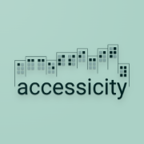

# Accessicity



Reiseplanung für Städtetrips für Menschen mit Einschränkungen

## Setup

Make sure to install the dependencies:

```bash
# npm
npm install
```

## Development Server

Start the development server on http://localhost:3000

```bash
npm run dev
```

## Production

Build the application for production:

```bash
npm run build
```

Locally preview production build:

```bash
npm run preview
```

## Deployment

To run the production version, you can simply use the provided Docker image
and [Docker-Compose file](docker-compose.yml):

```bash
docker pull ghcr.io/passidel/accessicity:latest
docker-compose up -d mariadb

# wait a few seconds for the db to be up
docker-compose up -d accessicity
```

## Seed

```sh
cat cities.geojson | node prisma/seed.js 
```
